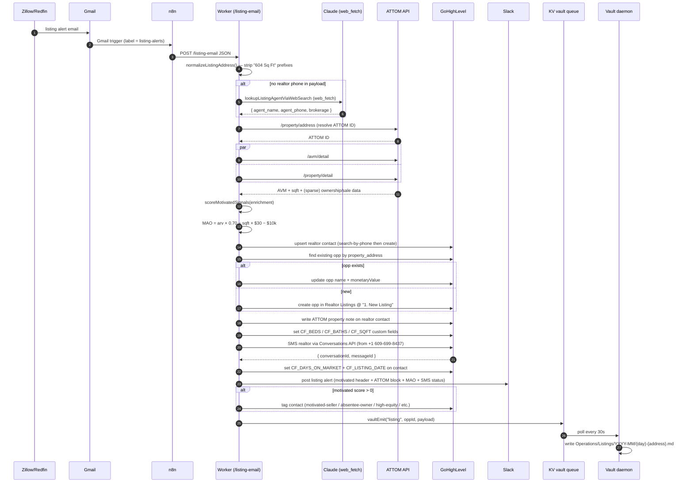

# Listing-bot workflow

> Source of truth: [`workers/blake-post-call/src/index.ts`](../workers/blake-post-call/src/index.ts) — `handleListingEmail` (line 965) and `handleListingEmailFromHtml` (~line 1735). This doc is hand-derived; if it disagrees with the code, the code wins.

## What this does

A Zillow / Redfin listing alert hits Gmail → n8n (or Zapier) picks it up → POSTs to the Worker → the Worker enriches with ATTOM, computes MAO, upserts the realtor as a GHL contact, opens an opportunity in the Realtor Listings pipeline, texts the realtor a cash offer, and alerts `#listed-leads`.

End goal: every new listing within our buy-box gets a cold cash offer to the listing agent within ~60 seconds of the email landing.

## Entry points

| Path | Method | Caller | Body |
|---|---|---|---|
| `/listing-email` | POST | n8n (after it parses the email), manual test | Structured JSON: `property_address`, `asking_price`, `city`, `state`, `postal_code`, `sqft`, `beds`, `baths`, `listing_url`, `listing_realtor_name`, `listing_realtor_phone`, `listing_realtor_email`, `days_on_market` (all optional except `property_address` + `asking_price`) |
| `/listing-email-from-html` | POST | n8n raw-HTML mode (when the parser is in the Worker, not n8n) | `{ subject, html }` — Worker parses the HTML itself, then internally delegates to `handleListingEmail` |

## End-to-end sequence



## Detailed steps with code anchors

### 0. Address normalization
- **Function:** `normalizeListingAddress` ([index.ts:940](../workers/blake-post-call/src/index.ts#L940))
- **Why:** upstream parsers sometimes prepend listing metadata ("602 Sq. Ft. 38 Karen Pl"). This was the Gloria Patterson bug (2026-05-26) — sqft leaked into the outbound SMS body.
- **Strips:** `<N> Sq Ft`, `<N> bd/bed`, `<N> ba/bath` prefixes. Loops up to 3× in case prefixes stack.

### 1. Realtor agent lookup (when phone is missing)
- **Function:** `lookupListingAgentViaWebSearch` (Claude API + `web_fetch_20250910` tool, sonnet-4-6)
- **Trigger:** `!realtorPhone && (listing_url || property_address)`
- **Returns:** `{ agent_name, agent_phone, agent_email, brokerage }` — best-effort, may be null
- **Fallback when web search fails:** opp gets created without realtor contact data; Slack message gets a `:mag: web-search returned nothing` tag

### 2. ATTOM enrichment
- See [docs/attom-capabilities.md](./attom-capabilities.md). KV-cached 24h. Never throws.

### 3. MAO calculation
```
MAO = max(0, round(arvProxy × 0.70 − sqft × $30 − $10,000))
```
- `arvProxy` = ATTOM AVM when available, else asking_price
- `sqft` = parsed sqft from email, else ATTOM `universalsize`, else 0
- Constants: `MAO_ARV_MULTIPLIER = 0.70`, `MAO_REHAB_PER_SQFT = 30`, `MAO_BUFFER = 10000`

### 4. Realtor contact upsert
- **Search:** `lookupContactDetailByPhone` (POST `/contacts/search` with the realtor's phone)
- **Create on miss:** POST `/contacts/` with name + phone + email + `source: "Zillow / Redfin Listing"` + tags `["realtor", "listing-pipeline"]`
- **Name normalization:** `titleCaseName` — fixes `VEERA BODAVULA` → `Veera Bodavula` so the SMS opener doesn't read as shouting.

### 5. Opportunity create-or-update
- **Pipeline:** `Br9cCXPJRNvtm3egHmwh` (Realtor Listings)
- **Stage:** `RL_STAGE_NEW_LISTING = 344694da-14cf-4f09-b690-67f07b4e5e1b` ("1. New Listing")
- **Dedupe:** `findRealtorListingOppByAddress` — if an opp in this pipeline already contains the property address in its name, update instead of create
- **Naming:** `buildListingOppName(realtorName, address, phone)` → `"Realtor Name / 38 Karen Pl / +17324947700"`
- **monetaryValue:** = MAO (so the opp card shows our offer)

### 6. ATTOM note + custom fields on the contact
- **Note** ([index.ts:1161](../workers/blake-post-call/src/index.ts#L1161)) — `formatEnrichmentForGhlNote` builds a comprehensive plain-text block (AVM + range + confidence, building specs, last sale, tax assessed, owner of record, absentee flag, MAO breakdown, motivated-seller summary). Written BEFORE the SMS sends so anyone opening the contact sees the full picture.
- **Custom fields:** `CF_BEDS`, `CF_BATHS`, `CF_SQFT`. Set conditionally — only when ATTOM returned a value.

### 7. SMS to realtor
- **Channel:** GHL Conversations API (`sendGhlSms`). NOT direct Twilio.
- **From number:** `+1 609-699-8437` (GHL's registered SMS number)
- **NOT from:** `+1 609-944-9034` (Blake's voice number — voice-only registration)
- **Why GHL not Twilio:** SMS gets recorded as a GHL conversation on the contact; realtor replies thread back automatically; no separate Twilio inbound webhook needed.
- **Body selection (`motivatedOpener` in [index.ts:1203](../workers/blake-post-call/src/index.ts#L1203)):**
  - `motivated.absentee` → "I work fast on out-of-state owner situations…"
  - `motivated.recentTransfer` → "I work a lot of probate / inherited-property sales…"
  - `motivated.highEquity` → "Looks like the owner has significant equity here…"
  - Default → "I'm an active buyer backed by private capital…"
- **Closer:** "Our cash offer as-is, close in 14 days, is $XXXk. No fees. Let me know your thoughts. Thanks."

### 8. Days-on-market + listing-date custom fields
- Written to `CF_DAYS_ON_MARKET` + `CF_LISTING_DATE` so the realtor contact list is sortable by listing staleness ("show me realtors with stalest listings").

### 9. Slack alert
- **Channel:** `#listed-leads`
- **Structure (top to bottom):**
  1. `:house: New listing landed — {fullAddress}`
  2. Motivated header (only if score > 0)
  3. Property line (bd / ba / sqft / DOM with color flags at 30/60 days)
  4. Asking + MAO breakdown with ARV source flag (✅ATTOM or ⚠️asking-proxy)
  5. ATTOM block (only when enrichment matched)
  6. Realtor name + phone + email + web-search tag
  7. SMS status (✅ sent or ❌ failed with error)
  8. Listing URL
  9. GHL opp ID + stage + created/updated

### 10. Motivated-seller tags
Best-effort: `motivated-seller` + any of `absentee-owner`, `high-equity`, `recent-transfer-probate`. Surface the contact in GHL's tag filters.

### 11. Vault emit
- `vaultEmit(env, "listing", opportunityId, {...})` → KV → daemon → `Operations/Listings/YYYY-MM/{day}-{address}.md` with the full enrichment + MAO + flags.

## Failure modes + observability

| What fails | How we know | What happens downstream |
|---|---|---|
| Address parse fails (no street + city + state + zip) | `400 missing_required_fields` returned to n8n | n8n records as failed run; nothing reaches GHL |
| ATTOM no-match | Worker log: `[listing] ATTOM no match for "…"`; Slack ARV flag = `:warning:asking-proxy` | MAO uses asking_price as ARV proxy. Motivated signals all default to 0. Pipeline still runs. |
| Realtor phone missing + web search returns nothing | Slack: `:mag: web-search returned nothing` | Opp + contact still created (with `phone: undefined`); SMS step is skipped with `sms.ok=false`. RJ can manually phone-search. |
| GHL realtor-contact upsert fails | Worker log: `[listing] failed to upsert realtor contact: {status}`; 500 response | Whole flow aborts. n8n should retry. |
| GHL opp create fails (after contact created) | Worker log: `[listing] opp create failed: {status}`; 500 response | Realtor contact exists in GHL but with no opp linked. Manual cleanup may be needed. |
| GHL SMS send fails | Slack: `:x: {status} {err}`; opp still created | RJ sees the failure in Slack, can manually text from GHL UI. |
| Slack post fails | Worker log: `[slack] post failed: {status}` | Silent in the UI. Only visible in Worker logs. |
| Vault emit fails | Worker log: `[vault-emit] type=listing id=… failed: …` | KV write retries are not built. The contact + opp still exist in GHL; only the vault markdown is missing. |
| Daemon offline | KV queue grows unboundedly | Events resume on next daemon tick. No data loss (KV has no TTL on queue keys). |

### Observability surfaces
- **Worker logs:** `wrangler tail` or Cloudflare dashboard. All `[listing]` prefixed.
- **Slack `#listed-leads`:** every successful run posts. Missing posts = failed run upstream.
- **GHL Realtor Listings pipeline:** every opp = one listing. Missing opps = failed at step 5 or earlier.
- **Vault `Operations/Listings/YYYY-MM/`:** every successful run = one markdown file.

## Out-of-scope (per May 26 meeting)

- **Realtor SMS reply handler** — when a realtor replies, the GHL conversation captures it but nothing automatically threads to Slack or bumps the opp stage. Tracked as a separate workstream.
- **Apify / RentCast ARV integration** — would replace the flat `$30/sqft` rehab assumption with real comp data. Deferred until MLS lands.
- **Email parsing in n8n vs Worker** — both code paths exist (`/listing-email` + `/listing-email-from-html`). n8n currently parses; Worker has a fallback parser for raw HTML.

## Related

- [`docs/attom-capabilities.md`](./attom-capabilities.md) — what ATTOM returns and how we use it
- [`tyler/project_apg_pillars.md`](../../.claude/projects/C--Users-midom/memory/tyler/project_apg_pillars.md) — Pillar B context
- [`tyler/project_ghl_acq.md`](../../.claude/projects/C--Users-midom/memory/tyler/project_ghl_acq.md) — GHL custom-field ID reference
